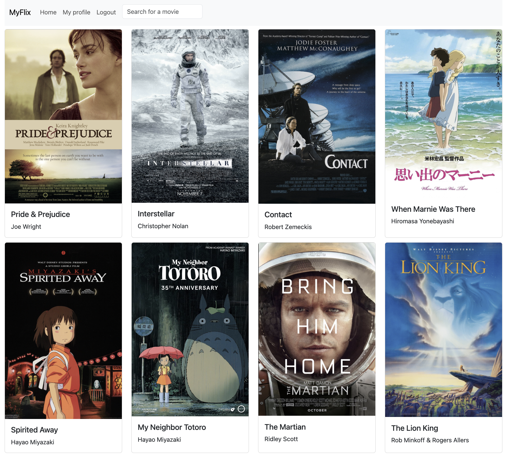

# MyFlix (React client)

The website "myFlix" is live and hosted at https://niersveryfirstmernproject.netlify.app/.

This project is the front-end client side of [myFlix-backend](https://github.com/NIER-BIAN/myFlix-backend) built with React, React Bootstrap, and Parcel. It includes functionalities for user authentication, signing up, logging in, maintaining a list of favorited movies on ones profiles, viewing movie details, searching for movies by name, and listing movies with the same genre in the database. The API consumed is y own API.

## Dev

1. Start the development server with `npx parcel src/index.html`
2. Remove cache between rebuilds with `rm -rf .parcel-cache`

---

中甴曱甲串申由田㗊𣊫㽬